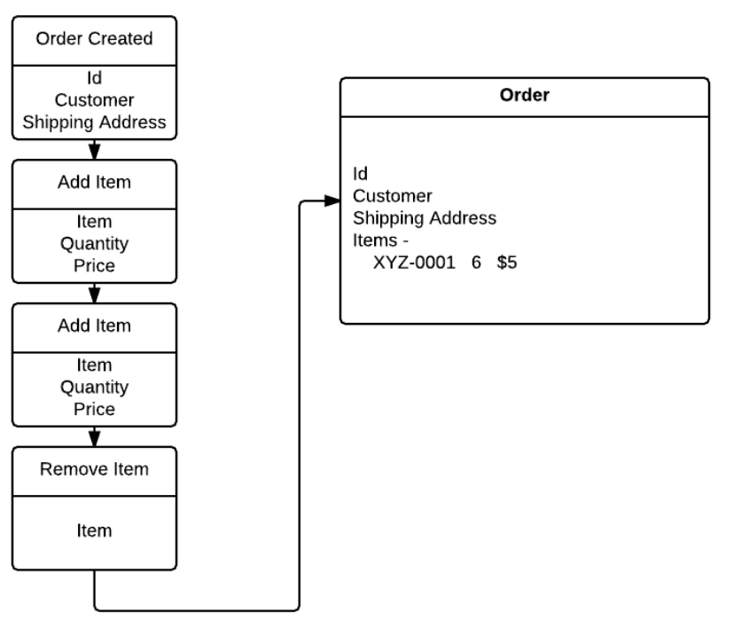
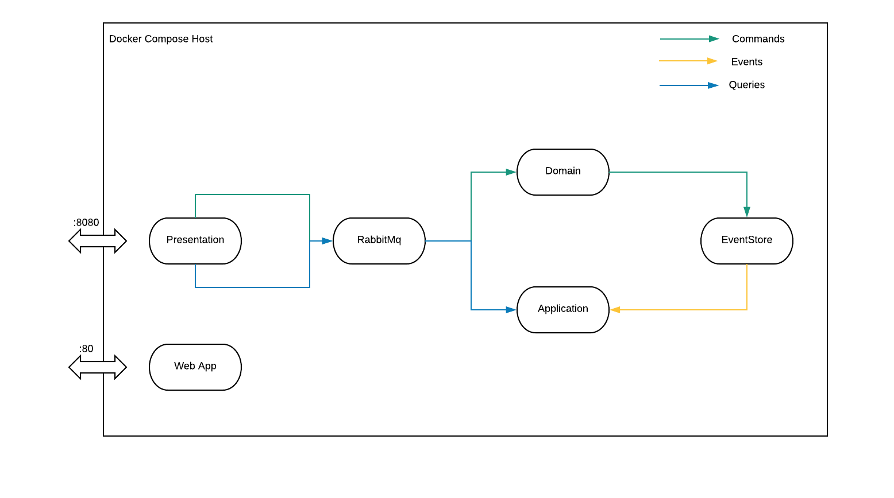
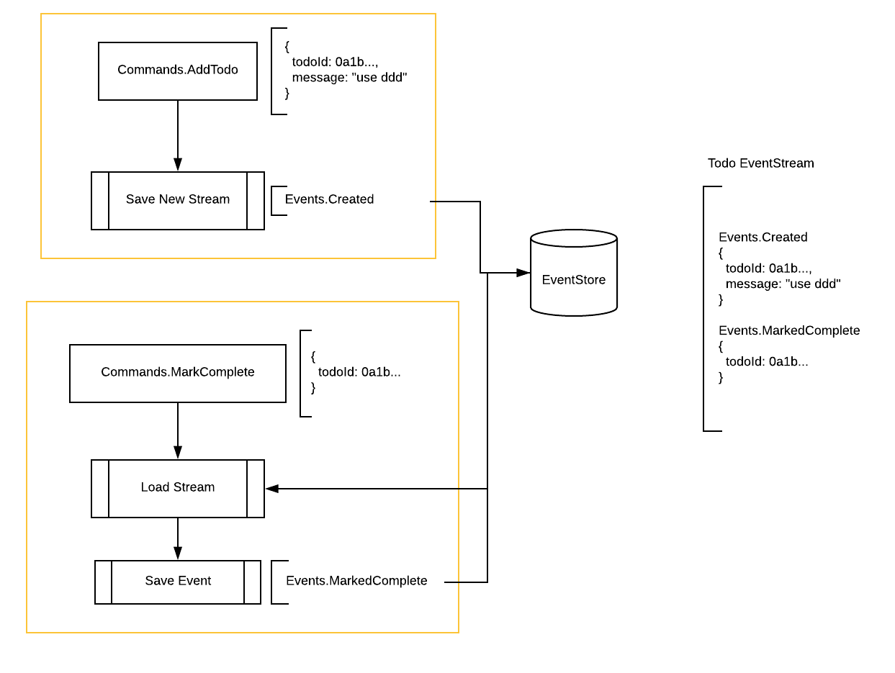

# eShopOnContainers (Aggregates.Net Edition)

This project is a fork (maybe better a loose copy) of Microsoft's container example [eShopOnContainers](https://github.com/dotnet-architecture/eShopOnContainers).  I implemented many of the same objects using my own DDD, EventSourcing library [Aggregates.NET](https://github.com/volak/Aggregates.NET) and its meant to be an illustrative example of a fully event sourced application.

## Like what you see?

We're hiring developers!  We are currently looking for a couple people to help develop new software for small/medium businesses - remote OK but located around Chicago is ideal.  If you have an interest in learning DDD, CQRS, EventSourcing and making distributed systems less complex send me an email or better yet open a pull request!

### Live Demo

[Currently running the app here](http://65.52.205.131) - might occasionally not work but the app is completely recycled every hour

### Wiki

There are articles in the Wiki about certain features of the app / how certain things are handled and implemented - check them out!

### Disclaimer

This is a project written over the course of a month in my free time.  Its not bug free, its not exploit free, it may not even be very clean in places.  Please don't judge too harsly 🙏 

# Instructions

**Linux Only**

One docker image we require to run (eventstore) doesn't have a windows container - so run `docker-compose` on linux only for now!

**Start**

from the linux-cli directory
```
export SERVICESTACK_LICENSE=<-Your license->
export HOST_SERVER=<-Machine's ip address->
./build.sh
./up.sh
```

**Note**

A NServiceBus license is not required to run this example - but a servicestack license is.
Its also required to supply the host machine's ip - use `localhost` if running localy

### What is EventSourcing?

EventSourcing is a process of representing domain objects (Orders, Invoices, Accounts, etc) as a series of separate events.

Your application ends up being 1 long audit log which records every state-changing event that occurs.  The advantage of this approach is other processes can read this event log and generate models that contain only the information the process cares about.  There is also additional information available that other services perhaps don't record themselves.

Imagine a shoppign cart which fills with items to buy.  The warehouse only cares about the final order of the stuff the customer actually agreed to purchase -



but the marketing team might care more about the items the customer removed from their cart **without** buying.  

Using eventsourcing correctly you can generate models which contain both sets of information to satisfy both departments with only 1 set of data.

### What is CQRS

CQRS stands for **Command and Query Responsibility Segregation**


In a nut shell - commands are everything that want to change the application state.  Queries are anything that want to read application state.  **There is no overlap**

Commands do not return any data other than if they were *Accepted* or *Rejected*. Accepted meaning the change was saved and read models will be updated.  Rejected meaning the command failed validation or was not valid to be run at this time.  (One example would be trying to invoice a sales order twice)

## Architecture Overview



## Commands Processing



### Good reads

* [Microsoft's CQRS architecture guide](https://docs.microsoft.com/en-us/azure/architecture/guide/architecture-styles/cqrs)
* [Microsoft's eventsourcing architecture guide](https://docs.microsoft.com/en-us/azure/architecture/patterns/event-sourcing)

### Libraries Used

**Backend**
* [Aggregates.NET](https://github.com/volak/Aggregates.NET)
* [NServiceBus](https://github.com/Particular/NServiceBus)
* [ServiceStack](https://github.com/ServiceStack/ServiceStack)
* [NEST](https://github.com/elastic/elasticsearch-net)
* [MongoDB.Driver](https://docs.mongodb.com/ecosystem/drivers/csharp/)

**FrontEnd**
* [Typescript](https://github.com/Microsoft/TypeScript)
* [MobX State Tree](https://github.com/mobxjs/mobx-state-tree)
* [React](https://github.com/facebook/react)
* [MaterialUi](https://github.com/mui-org/material-ui)
